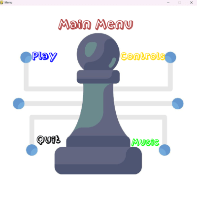
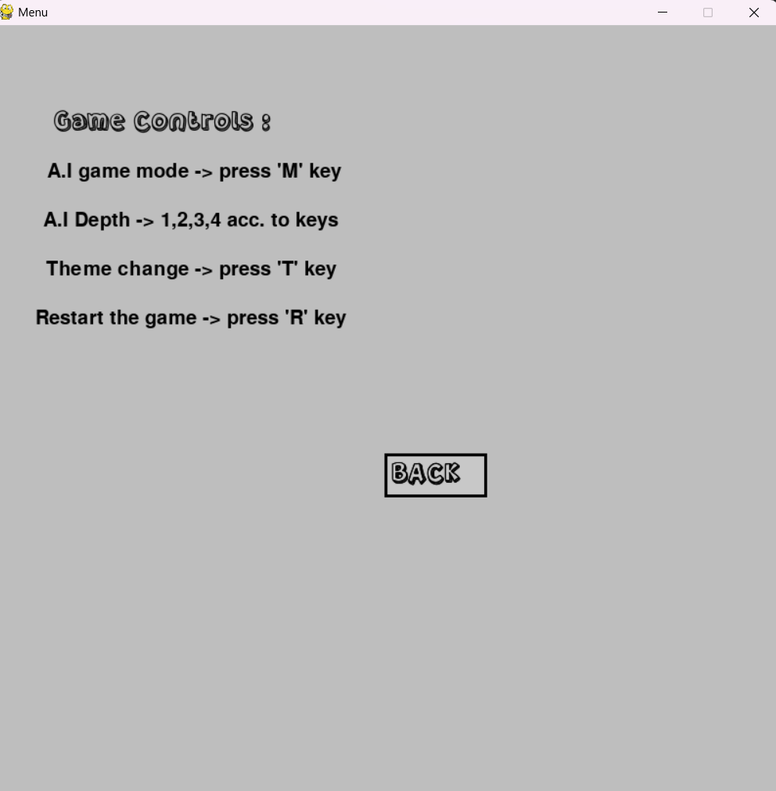
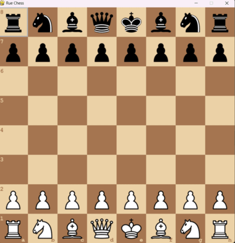
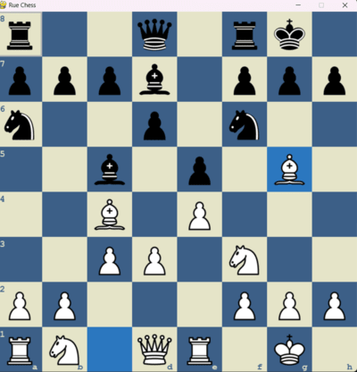
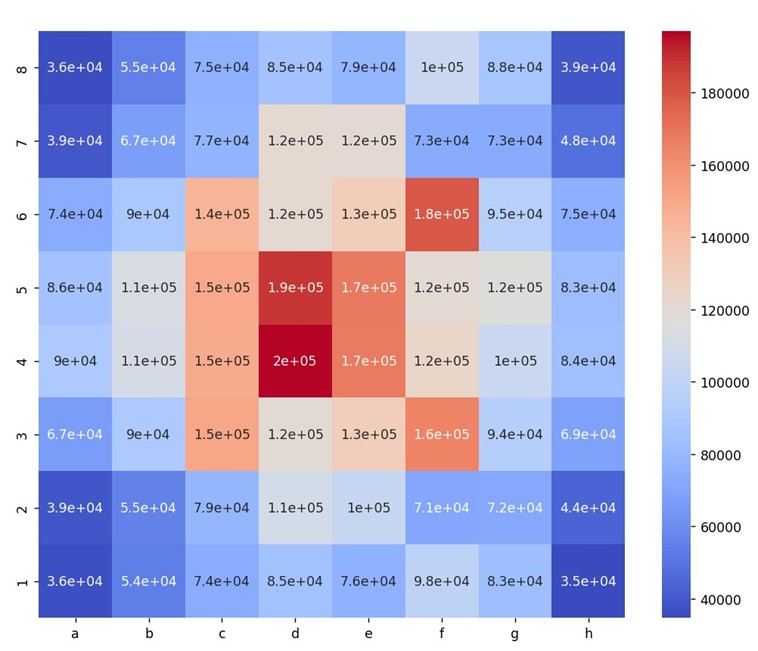
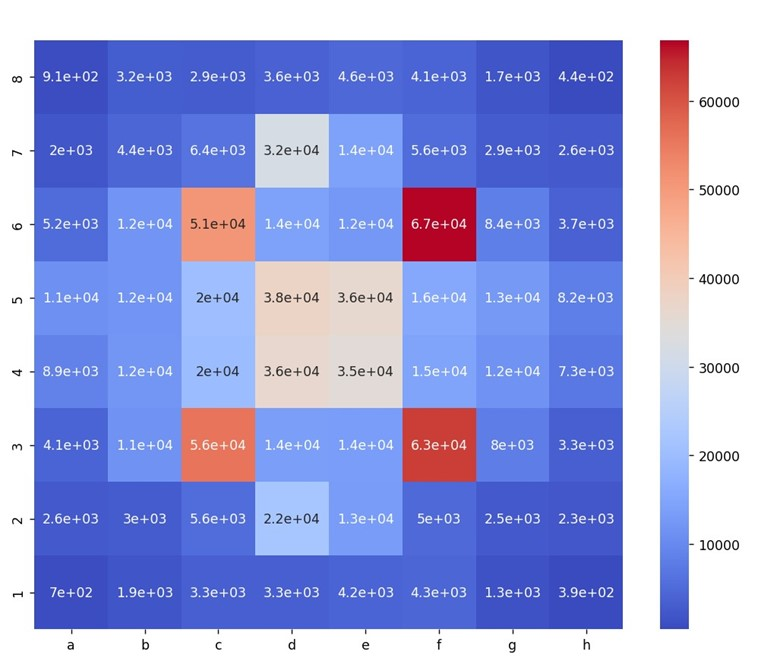
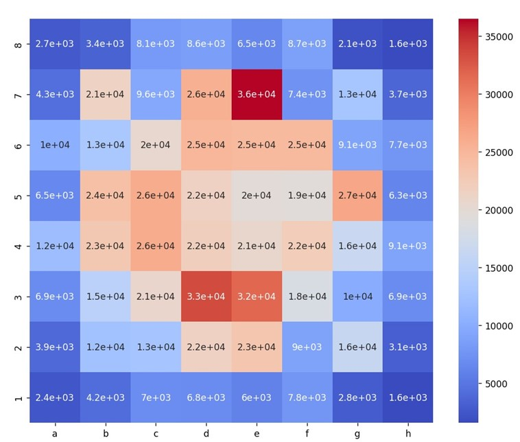
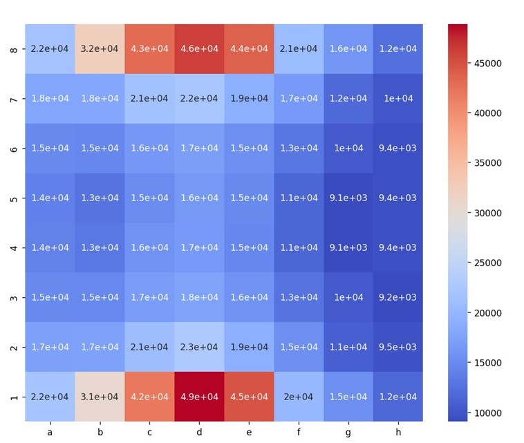
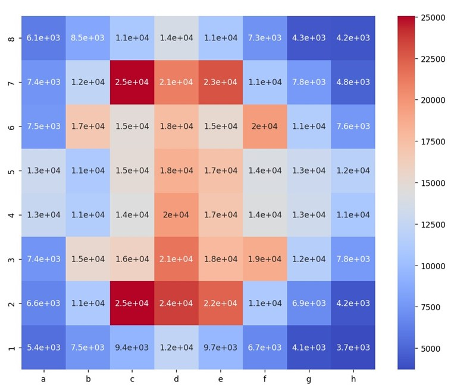

## Getting Started

run Rue_Chess.exe to run the project.

run Rue_Chess_C.exe to run the project with console window.

## Documentation

check out the documentation to learn about the development and other details of the project.

## Project Images

# ♟️ Chess Move Heatmap Analysis using Python

## 📌 Objective

This project analyzes chess games and visualizes the frequency of moves to each square on a chessboard. Using a dataset of ~50,000 chess games, it highlights which squares are most frequently reached overall and by individual pieces.

---

## 🛠️ Tools & Technologies

- Python 🐍
- Pandas
- NumPy
- Matplotlib
- Seaborn

---

## 📂 Dataset

- **Source**: [Kaggle - Chess Games Dataset](https://www.kaggle.com/)
- **Size**: ~50,000 games
- **Used Column**: `Moves` (PGN-style notation)

---

## 🔄 Data Preprocessing

- Loaded the CSV dataset using `pandas`.
- Retained only the `Moves` column.
- Cleaned the PGN notation by:
  - Removing move numbers (`1.`, `2.`, etc.)
  - Handling special notations: check (`+`), checkmate (`#`), castling (`O-O`, `O-O-O`)
  - Parsing final destination squares of each move
- Built a dictionary of all board squares (`a1` to `h8`) initialized with zero values.

---

## 🧠 Core Logic

### ✔️ Square Frequency Heatmap

- Parsed each game's moves.
- Counted the final square of each move.
- Reshaped the data into an 8×8 matrix.
- Visualized using Seaborn's heatmap.

### ✔️ Piece-wise Heatmaps

- Filtered moves by piece:
  - `N`: Knight
  - `B`: Bishop
  - `R`: Rook
  - `Q`: Queen
  - `K`: King
- Generated individual heatmaps for each piece.

---

## 📊 Visualization

- Used `matplotlib` and `seaborn` to generate annotated heatmaps.
- X and Y axes represent standard chessboard files (`a`-`h`) and ranks (`1`-`8`).
- Color intensity shows the number of times a square is reached.

### Overall data

### Knight data

### Bishop data

### Rook data

### Queen data

