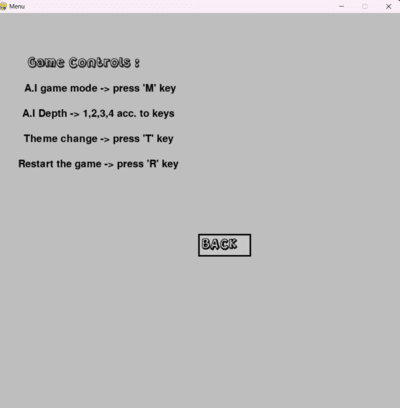

## Getting Started

run Rue_Chess.exe to run the project.

run Rue_Chess_C.exe to run the project with console window.

## Documentation

check out the documentation to learn about the development and other details of the project.

## Project Images

